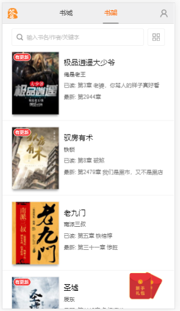

项目介绍

读书在小米 创作无极限 —— 这个口号一直是起点众多玄幻、魔幻、武侠、军文小说作者的创作目标，严谨的写作态度，锲而不舍的求新求变，与书友的直接沟通交流修改，从而起点中文网拥有国内很多具有一流水平的原创作品，使书友得以在第一时间阅读到作者连载的好书佳作。

技术栈

gulp + require + handlebars + ES6/7 + ajax + sass + flex + canvas + 懒加载

项目运行

    git clone git@github.com:typeofYh/6bookcity.git
    npm install --save-dev
    npm run build

目录结构

>bigbook

mock
``````
// json数据
|----mock
    |---detail
        |---352876.json
    |---home
        |---home.json
        |---recommend1.json
        |---recommend2.json
        |---recommend3.json
    |---login
        |---user.json
    |---reader
        |---chapter-list.json
        |---data1.json
        |---data2.json
        |---data3.json
        |---data4.json
    |---search
        |---search(1).json
        |---search.json
        |---searchKey.json
    |---home.js // 配置接口
````````
src
``````
    |---dest // 压缩后的css、js
    |---fonts // 字体图标
    |---img // 图片
    |---js // 编写js的功能
        |---compile
            |---compile.js
            |---getUrl.js
        |---detail
            |---detail.js
        |---index
            |---index.js
        |---lib
            |---better.js
            |---bootstrap.min.js
            |---handlebars-v4.0.11.js
            |---jquery.base64.js
            |---jquery.js
            |---jquery.lazyload.js
            |---requery.js
            |---requery.text.js
            |---swiper-4.1.6.min.js
            |---zepto.js
        |---login
            |---login.js
        |---menu
            |---menu.js
        |---search
            |---search.js
        |---text
            |---text.js
        |---main.js // 配置主入口文件
    |---page // 其它页面
        |---detail.html //详情页
        |---login.html // 登录页
        |---menu.html // 目录页
        |---search.html // 搜索页
        |---text.html // 阅读页
    |---scss // scss样式
    |---template // 编写的handlebars模板
        |---block_list.html // 本周最火和限时抢购
        |---book-self.html // 书架
        |---detail.html // 详情页
        |---dl_love.html // 男女生最爱
        |---import.html // 重磅推荐
        |---index.html // 渲染的主模板
        |---inp.html
    |---index.html // 首页
``````
gulpfile.js 


pagejson.json

部分截图





